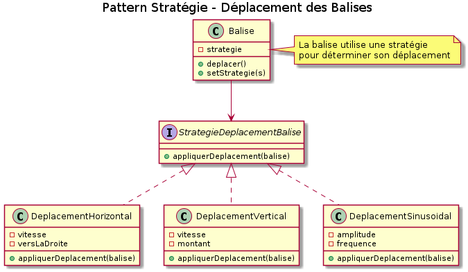
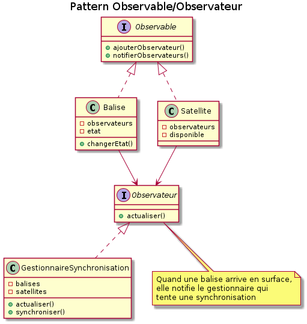
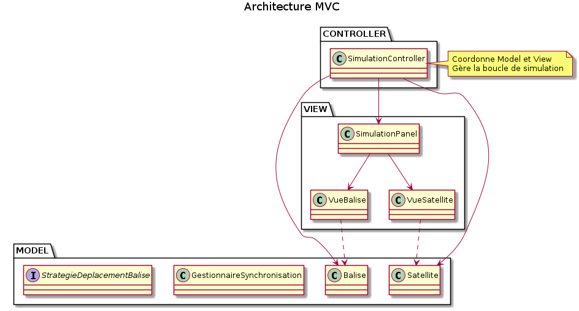
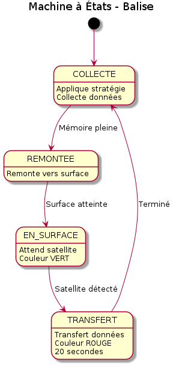
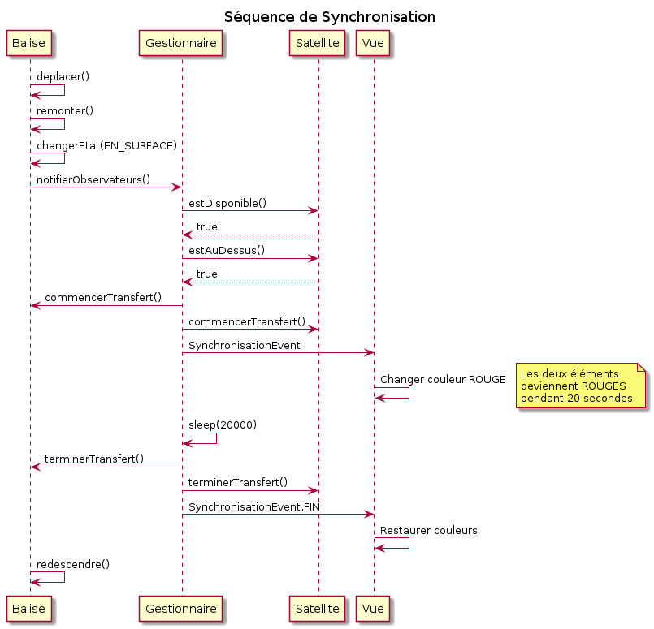

## 3. Patterns de Conception Utilisés

### 3.1 Pattern Stratégie (Obligatoire)

Le pattern Stratégie permet de définir une famille d'algorithmes de déplacement
pour les balises (horizontal, vertical, sinusoïdal, immobile) et de les rendre
interchangeables. Cela permet de changer le comportement d'une balise dynamiquement
à l'exécution sans modifier son code.

**Classes impliquées :**
- Interface : `StrategieDeplacementBalise`
- Contexte : `Balise`
- Stratégies concrètes : `DeplacementHorizontal`, `DeplacementVertical`,
  `DeplacementSinusoidal`, `DeplacementImmobile`

### 3.2 Pattern Observable/Observateur (Obligatoire)

Ce pattern établit une relation de dépendance un-à-plusieurs entre le
GestionnaireSynchronisation et les éléments mobiles (Balise, Satellite).
Lorsqu'une balise remonte en surface, elle notifie automatiquement le gestionnaire
qui peut alors tenter une synchronisation avec un satellite disponible.

**Classes impliquées :**
- Interfaces : `Observable`, `Observateur`
- Observables : `Balise`, `Satellite`
- Observateur : `GestionnaireSynchronisation`

### 3.3 Architecture MVC

L'application respecte l'architecture Modèle-Vue-Contrôleur pour séparer les
responsabilités :
- **Modèle** : Logique métier (Balise, Satellite, Stratégies)
- **Vue** : Interface graphique avec Nicellipse (SimulationPanel, VueBalise, VueSatellite)
- **Contrôleur** : Coordination (SimulationController)

### 3.4 Pattern État

Les balises utilisent une machine à états (enum EtatBalise) pour gérer leur
cycle de vie : COLLECTE, REMONTEE, EN_SURFACE, SYNCHRONISATION, TRANSFERT.
Le comportement de la balise change selon son état actuel.

### 3.5 Intégration des Patterns

Un système d'événements basé sur le pattern Observer permet la communication
découplée entre le modèle et la vue via des événements typés
(BaliseEvent, SatelliteEvent, SynchronisationEvent).